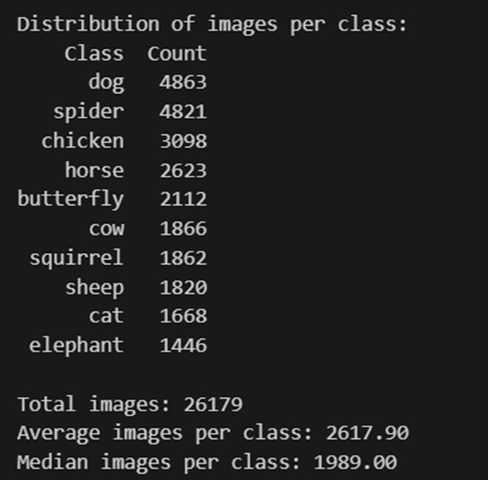
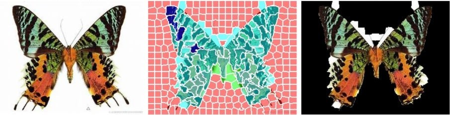
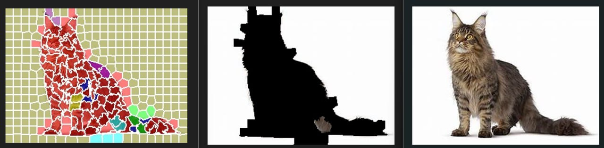
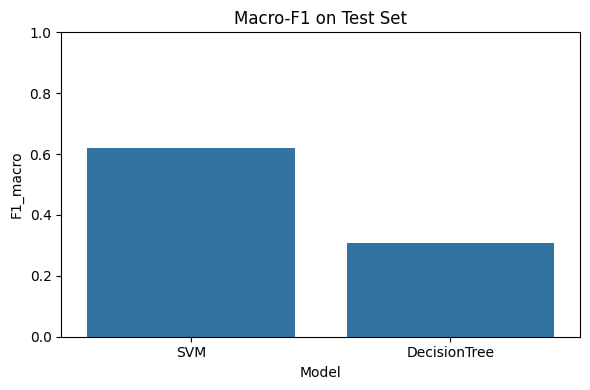
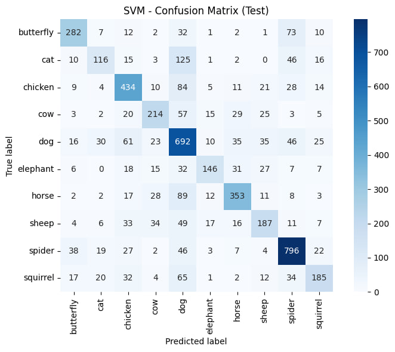
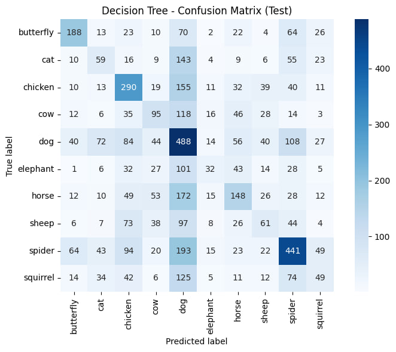
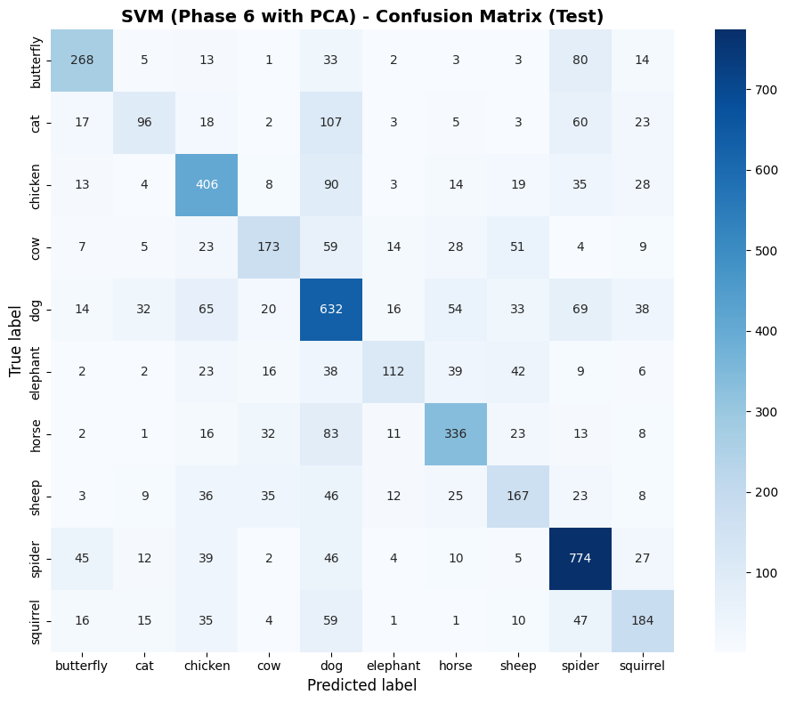
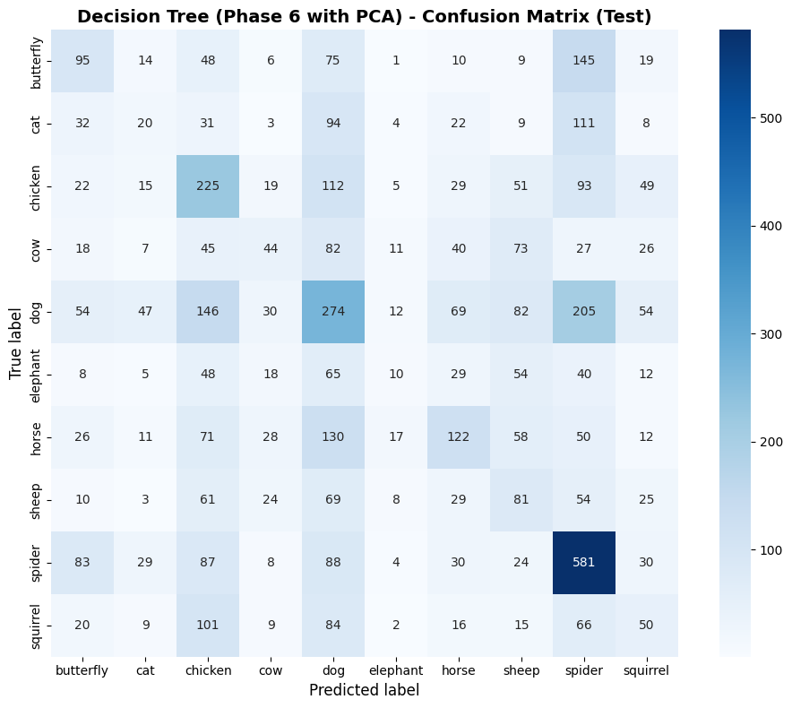

# Animal-10: Region-Based Image Classification with SVM & Decision Trees

Classifying 10 animal classes using classical hand-crafted features (color, GLCM, LBP, HOG, edge statistics) with SVM and Decision Tree models — then testing a hypothesis: can accuracy be *improved* by first segmenting each image into superpixels, scoring each region's importance to the model, and discarding the ones the model doesn't rely on? Built for the **Computational Intelligence** course at Ferdowsi University of Mashhad.

Full write-up with all figures and analysis: [`docs/report.pdf`](docs/report.pdf).

## Dataset

[Animal-10 (Kaggle)](https://www.kaggle.com/datasets/viratkothari/animal10) — 26,179 images across 10 classes, noticeably imbalanced (4,863 dog vs. 1,446 elephant) and highly non-uniform in size (image width ranges from 60 to 6,720 px):

<p align="center">
  
</p>

Exploratory analysis (phase 1) found that brightness/contrast are not class-uniform, but dominant color channel ratios differ meaningfully between classes (e.g. green/brown for outdoor grazers like `sheep`/`horse`/`cow`, gray tones for `squirrel`/`elephant`), which motivated using color histograms as first-class features rather than relying on texture alone.

## Pipeline

The project runs the *same* modeling pipeline twice — once on full images, once on region-pruned images — to measure whether automatic "unimportant region removal" actually helps.

| Phase | File | What it does |
|---|---|---|
| 1 | [`phase1.ipynb`](phases/phase1.ipynb) | Data exploration & profiling: class balance, image dimensions, color modes, brightness/contrast/color distribution per class. |
| 2 | [`phase2.py`](phases/phase2.py) | Feature extraction on full images: RGB+HSV color stats, GLCM, LBP, HOG, edge/contour features → `feature2.csv` (~1,800 features/image). |
| 3 | [`phase3.ipynb`](phases/phase3.ipynb) | Train/test split (80/20), standardize, PCA (to make SVM hyperparameter search tractable on ~1,800 features), then baseline SVM + Decision Tree, followed by `RandomizedSearchCV` tuning of both. |
| 4 | [`phase4.ipynb`](phases/phase4.ipynb) | Evaluation of the tuned models: accuracy/precision/recall/F1 (macro), confusion matrices, per-class error analysis. |
| 5 | [`phase5.ipynb`](phases/phase5.ipynb) | **Region-based pruning**: SLIC superpixels → two-stage hybrid clustering (DBSCAN then Ward-linkage Agglomerative) into ~10–25 coherent regions per image → per-region importance scoring via SVM confidence drop → mask out the least important regions. |
| 6 | [`phase6_feature.py`](phases/phase6_feature.py), [`phase6.ipynb`](phases/phase6.ipynb) | Re-extract features from the region-pruned images and retrain SVM/Decision Tree on them ("Train2"). |
| 7 | [`phase7.ipynb`](phases/phase7.ipynb) | Re-evaluate the pruned-image models and analyze the resulting accuracy change. |
| 8 | *(extra credit — in* [`phase5.ipynb`](phases/phase5.ipynb) */* [`phase7.ipynb`](phases/phase7.ipynb)*)* | Apply the same segmentation + region-removal pipeline to the **test** images too (phases 1–7 only pruned training data), and re-evaluate the full pipeline end to end. |

## How region pruning works (phase 5)

1. **Superpixel generation (SLIC):** ~250–300 superpixels per image in Lab color space, tuned for compactness so segment boundaries follow natural object edges rather than a rigid grid.
2. **Two-stage clustering:** SLIC over-segments on purpose, so superpixels are merged into ~10–25 semantically coherent regions using DBSCAN first (finds irregular, density-based groups like sky/background without a predefined cluster count) and then Ward-linkage Agglomerative clustering (merges DBSCAN's noise points and remaining clusters down to a fixed target count).
3. **Region importance via SVM confidence drop:** each region is masked out (replaced with flat gray) one at a time, and the drop in the trained SVM's confidence for the image's true class measures that region's "delta score" — how much the model actually relies on it.
4. **Pruning:** the lowest-importance regions are masked out (keeping the top `n_keep`, typically 3–4 of ~5 clusters), producing a version of the image with background/distracting regions removed.

This works well when the retained regions really are the discriminative ones:

<p align="center">
  
</p>

...but it can fail badly when the SVM-confidence criterion doesn't line up with the true object, occasionally erasing the entire animal because the model's confidence didn't depend heavily on any single superpixel of it:

<p align="center">
  
</p>

## Results

**Baseline (phase 3/4, full images, tuned):**

| Model | Test Accuracy | Test Macro-F1 |
|---|---|---|
| SVM (RBF, tuned) | **0.65** | **0.62** |
| Decision Tree (tuned) | 0.35 | 0.31 |

<p align="center">
  
</p>

SVM substantially outperforms the Decision Tree — it builds a more balanced decision boundary across classes, while the Decision Tree overfits (train accuracy 0.52 vs. test 0.35) and produces far noisier per-class errors:

<p align="center">
  
  
</p>

Both models' most common mistake is predicting `dog` — the largest and most visually diverse class — for `spider`, `cat`, and other classes; `spider` vs. `dog` alone accounts for 193 Decision Tree errors and 46 SVM errors.

**After region removal (phase 6/7, pruned images):**

| Model | Test Accuracy | Test Macro-F1 |
|---|---|---|
| SVM (RBF, tuned) | 0.60 | 0.56 |
| Decision Tree (tuned) | 0.29 | 0.22 |

<p align="center">
  
  
</p>

Removing "unimportant" regions **reduced** accuracy by ~5–9 points for both models rather than improving it. The report's root-cause analysis identifies three factors:

1. **The importance criterion is imperfect** — "unimportance" is defined relative to the *current* SVM's confidence, not true class-discriminative value, so genuinely informative regions get pruned by mistake in a meaningful fraction of images (as in the cat example above).
2. **Context helps more than expected** — background cues (grass, webs, natural habitat) sometimes aid classification even though they aren't the animal itself; removing them removes real signal along with noise.
3. **The masking itself distorts features** — flat-gray masking changes color statistics, and creates artificial edges at mask boundaries that corrupt HOG/GLCM/LBP features computed near them, on top of forcing a resize that further perturbs gradient-based descriptors.

## Project structure

```
.
├── phases/
│   ├── phase1.ipynb              # Data exploration
│   ├── phase2.py                 # Feature extraction (full images)
│   ├── phase3.ipynb              # Baseline + tuned SVM/Decision Tree
│   ├── phase4.ipynb              # Evaluation
│   ├── phase5.ipynb              # SLIC segmentation + region importance + pruning (+ phase 8)
│   ├── phase6_feature.py         # Feature extraction (region-pruned images)
│   ├── phase6.ipynb              # Retrain on pruned images
│   └── phase7.ipynb              # Re-evaluation (+ phase 8)
├── csv/
│   ├── phase1_class_distribution.csv
│   └── phase1_class_statistics.csv
├── results/
│   └── images/                   # Figures pulled from the report (this README)
├── docs/
│   ├── report.pdf                # Full write-up: all 8 phases, figures, analysis
│   └── assignment.pdf            # Original course assignment description
├── requirements.txt
└── README.md
```

Extracted feature CSVs (`feature2.csv`, etc.), trained model `.pkl` files, and the dataset itself are not committed (see `.gitignore`) — they're regenerated by running the phases in order.

## Getting started

```bash
pip install -r requirements.txt
```

Datasets are not committed and must be placed at the repository root as `Dataset/Animals-10/<class>/...` (used by `phase2.py`) and, for the region-removal pipeline, `newDataset_train_all/` and `Dataset/split-animal/` (used by `phase6_feature.py`) — adjust the `DATA_DIR` constants at the top of each script if your local layout differs.

Run in order: `phase1` → `phase2.py` → `phase3` → `phase4` → `phase5` → `phase6_feature.py` → `phase6` → `phase7`.

## Team

- Amirreza Khadempir
- Hanieh Ghavipanjeh

Course: Computational Intelligence — Computer Engineering Department, Ferdowsi University of Mashhad
Instructor: Dr. Ehsan Fazl Ersi
